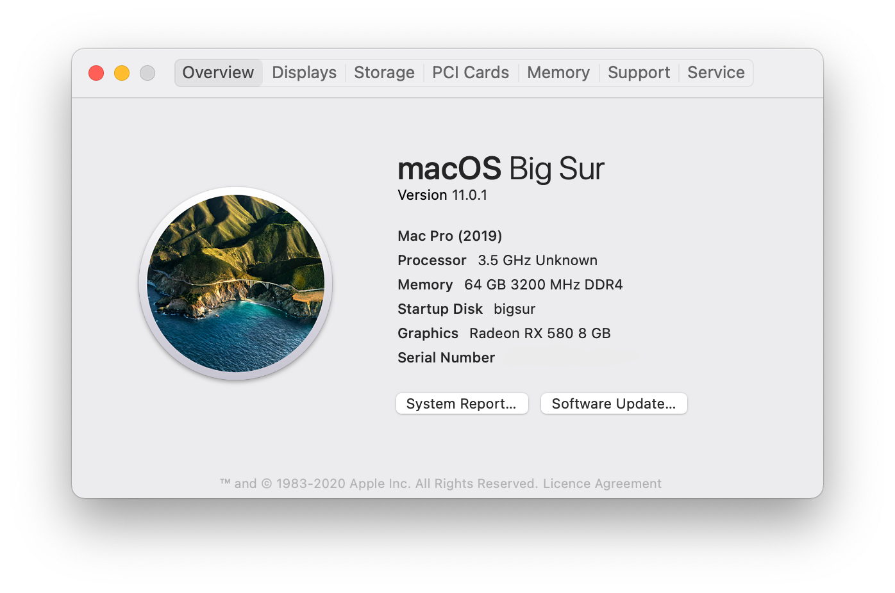
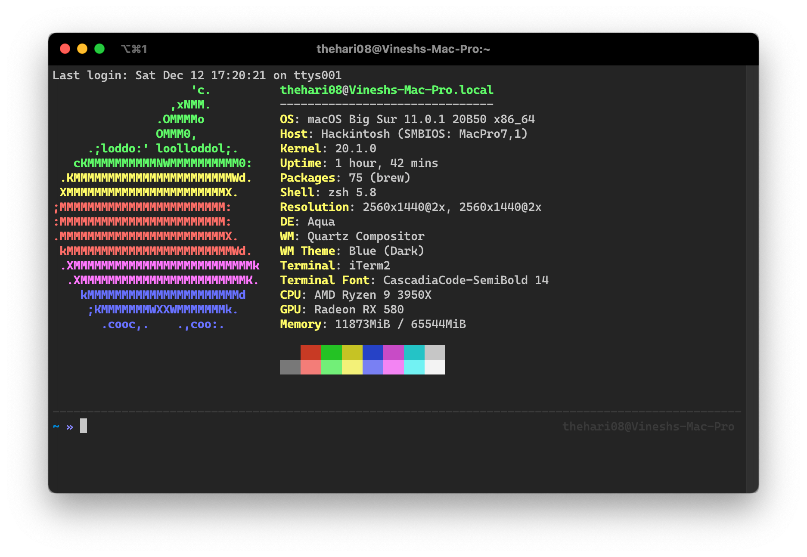

## Ryzentosh - Opencore EFI for MSI MAG X570 TOMAHAWK WIFI

Basic EFI folder to run macOS Big Sur on a MSI MAG X570 TOMAHAWK WIFI motherboard

### Build Specs

**MotherBoard** : MSI MAG X570 TOMAHAWK WIFI

**Processor**   : AMD Ryzen 9 3950X 16 core Processor

**Graphics**    : Radeon RX 580

**Memory**      : G.SKILL RIPJAWS DDR4 3200MHz - 4x16GB

**Storage**     : Samsung NVMe SSD 970 EVO PLUS 1TB x2 & WESTERN DIGITAL SATA HARDDISK 4TB

### Status
Everything is working just fine for me **except**

- Anything using Intel VT-d
- Unstable Bluetooth LE connection - tested with MX Master 3

### macOS Installation

**OpenCore**            :   0.6.4

**Kernel AMD Patches**  :   opencore

**Version**             :   11.0.1 (Big Sur) 

**SMBIOS**              :   MacPro7,1

#### Neofetch

### Guides Used

- [Opencore Guide][1]
- [Fixing MacPro7,1 Memory Errors][2]
- [Internal Drives shown as external][3]

[1]: https://dortania.github.io/OpenCore-Install-Guide
[2]: https://dortania.github.io/OpenCore-Post-Install/universal/memory.html#mapping-our-memory
[3]: https://www.reddit.com/r/hackintosh/comments/f0cc4t/internal_drives_shown_as_external_opencore_amd